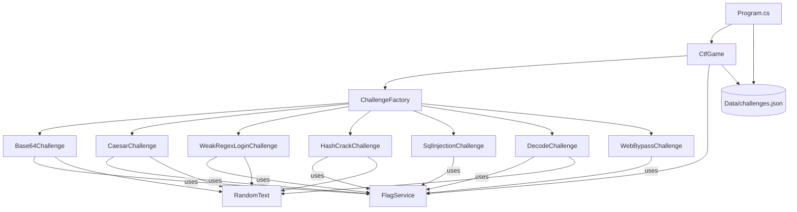
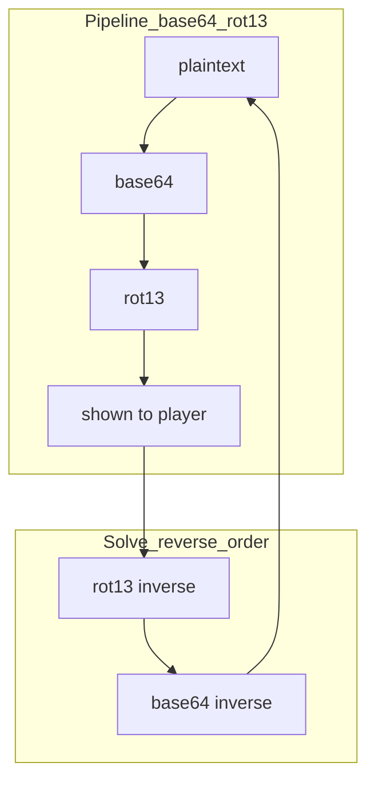
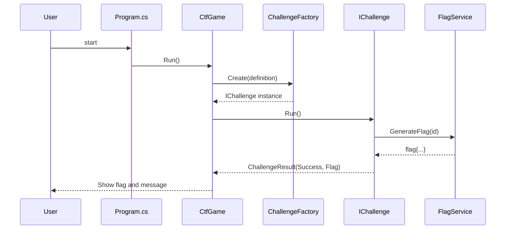

# Mini CTF (Console Game)

A lightweight C# console application delivering a text-based Capture The Flag experience with educational cybersecurity puzzles.

## Features

- 50 unique CTF challenges (no repetition)
- Multi-mode Decode engine: base64, hex, url, rot13, rot47, atbash, reverse, ascii-dec, ascii-oct, binary8, leetspeak, vigenere, railfence, plus pipelines (e.g., `base64|rot13`)
- WebBypass engine: open-redirect, path-traversal, command injection, XSS, IDOR
- Dynamic per-run challenge content (problems change each execution)
- Dynamic HMAC-based flags (no flags stored in JSON; optional `MINI_CTF_SECRET` for stable flags)
- JSON-driven challenge definitions for easy extension

## Requirements

- .NET 8 SDK

## Run

1. Restore and build.
2. Run the console app.

On Windows PowerShell:

```powershell
# From the project folder
dotnet build ; dotnet run
```

## Structure

- `Program.cs` – entry point
- `Engine/` – game loop and challenge factory
- `Puzzles/` – individual challenge implementations
- `Models/` – interfaces and models
- `Data/challenges.json` – challenge definitions

## Diagrams

### Architecture (high-level)



### Decode pipelines (how to solve)



### Challenge run (sequence)



## Adding New Challenges

1. Create a new class in `Puzzles/` implementing `IChallenge` and accepting a `ChallengeDefinition` in the constructor.
2. Register the type in `Engine/ChallengeFactory.cs`.
3. Add a new entry in `Data/challenges.json` with `type`, `title`, `prompt`, `order`, and `parameters`.
   - Note: Flags are generated dynamically via HMAC using the challenge `id`. Do not store static flags in JSON.
   - Optional: Set an environment variable `MINI_CTF_SECRET` to a stable secret if you want flags to be consistent across runs.

## Topics

Add these GitHub topics to help others discover the project:

`ctf`, `capture-the-flag`, `security`, `cybersecurity`, `cryptography`, `c`, `dotnet`, `dotnet-8`, `csharp`, `c`, `education`, `learning`, `reverse-engineering`, `web-security`, `encoding`

## Educational Notes

- Base64: Encoding vs encryption
- Caesar: Brute-force and classical ciphers
- Regex: Pitfalls of using weak or partial-matching regex for auth

## Roadmap

- Scoring, hints, and leaderboard
- CI (build/test) and packaged puzzle packs for classrooms and training
- More decode pipelines and web vuln variants

---
Enjoy and learn!
